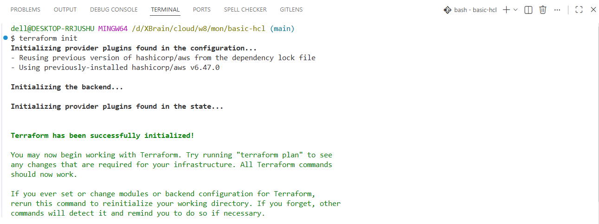
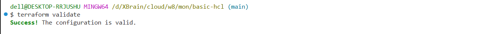
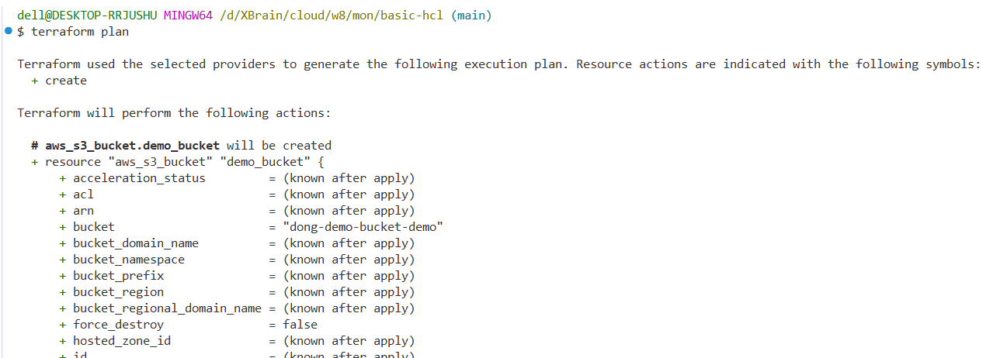
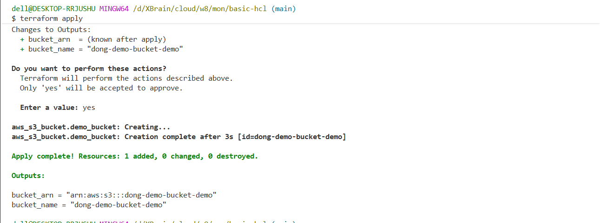
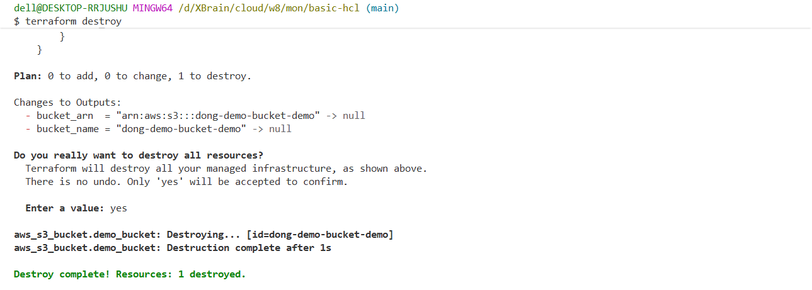

# W8 Day A - Terraform: IaC Overview + HCL Syntax

Ngày học: T2 01/06/2026  
Chủ đề: Terraform phần 1 - Infrastructure as Code overview + HCL syntax

## Mục tiêu hôm nay

- Hiểu Infrastructure as Code là gì và vì sao Cloud/DevOps dùng IaC.
- Nắm vai trò của Terraform trong quản lý hạ tầng AWS.
- Hiểu các khối HCL cơ bản: `terraform`, `provider`, `resource`, `variable`, `output`, `locals`, `data`.
- Biết đọc một file Terraform tối thiểu và giải thích được từng phần.
- Chuẩn bị nền tảng cho Day B: Terraform workflow, state, modules và best practices.

## Nguồn học hôm nay

### Bắt buộc

1. HashiCorp Learn - Get Started with Terraform on AWS  
   https://developer.hashicorp.com/terraform/tutorials/aws-get-started

2. Terraform Docs - Configuration Language  
   https://developer.hashicorp.com/terraform/language

3. Terraform Docs - Providers  
   https://developer.hashicorp.com/terraform/language/providers

4. Terraform Docs - Resources  
   https://developer.hashicorp.com/terraform/language/resources

5. Terraform Registry - AWS Provider  
   https://registry.terraform.io/providers/hashicorp/aws/latest/docs

### Đọc thêm

1. AWS Prescriptive Guidance - Using Terraform as an IaC tool for AWS  
   https://docs.aws.amazon.com/prescriptive-guidance/latest/choose-iac-tool/terraform.html

2. Terraform Best Practices  
   https://www.terraform-best-practices.com

3. Terraform from Basics to Production - Mentor Nghĩa Huỳnh  
   https://kkloudtarus.net/en/blog/series/terraform-from-basics-to-production

## Kế hoạch học 6 giờ

| Thời lượng | Nội dung                                        | Output cần có                                                     |
| ---------- | ----------------------------------------------- | ----------------------------------------------------------------- |
| 45 phút    | Đọc IaC overview và Terraform introduction      | Ghi được Terraform giải quyết vấn đề gì                           |
| 60 phút    | Đọc HCL syntax và các block cơ bản              | Ghi chú `terraform`, `provider`, `resource`, `variable`, `output` |
| 60 phút    | Đọc AWS provider docs và cách khai báo provider | Giải thích provider AWS cần region/credentials như thế nào        |
| 90 phút    | Viết sample Terraform tối thiểu                 | Có file HCL mẫu và giải thích từng block                          |
| 60 phút    | Đọc trước workflow `init/plan/apply/destroy`    | Biết lệnh nào làm việc gì                                         |
| 45 phút    | Tổng kết reflection và câu hỏi cho mentor       | Cập nhật phần Evidence và Questions                               |

## Ghi chú bài học

### 1. Infrastructure as Code là gì?

Infrastructure as Code là cách quản lý hạ tầng bằng file cấu hình có version control thay vì thao tác thủ công trên console. Với IaC, hạ tầng có thể được review, tái sử dụng, kiểm tra thay đổi và rollback dễ hơn.

Các lợi ích chính:

- Hạ tầng có thể lưu trong Git như source code.
- Thay đổi có thể review qua pull request.
- Môi trường dev/staging/prod dễ đồng bộ hơn.
- Giảm lỗi thao tác thủ công.
- Tạo được bằng chứng học tập và vận hành qua commit history.

### 2. Terraform dùng để làm gì?

Terraform là công cụ IaC dùng để khai báo trạng thái mong muốn của hạ tầng. Terraform đọc file cấu hình, so sánh với state hiện tại và tạo execution plan trước khi thay đổi hạ tầng thật.

Terraform phù hợp trong Cloud/DevOps vì:

- Hỗ trợ nhiều cloud/provider, trong đó có AWS.
- Dùng ngôn ngữ khai báo HCL dễ đọc.
- Có workflow rõ ràng: write, init, plan, apply.
- Có Terraform Registry để tái sử dụng provider và module.

### 3. HCL syntax cơ bản

HCL là ngôn ngữ cấu hình của Terraform. Một file Terraform thường có cấu trúc dạng block:

```hcl
block_type "label_1" "label_2" {
  argument = "value"
}
```

Ví dụ các block thường gặp:

```hcl
terraform {
  required_version = ">= 1.6.0"

  required_providers {
    aws = {
      source  = "hashicorp/aws"
      version = "~> 5.0"
    }
  }
}

provider "aws" {
  region = var.aws_region
}

variable "aws_region" {
  description = "AWS region for resources"
  type        = string
  default     = "ap-southeast-1"
}

resource "aws_s3_bucket" "learning" {
  bucket = "dong-aws-accelerator-p2-learning"
}

output "bucket_name" {
  description = "Created S3 bucket name"
  value       = aws_s3_bucket.learning.bucket
}
```

### 4. Ý nghĩa từng block

| Block                | Vai trò                                                 |
| -------------------- | ------------------------------------------------------- |
| `terraform`          | Khai báo version Terraform và provider cần dùng         |
| `required_providers` | Chỉ định provider source và version                     |
| `provider`           | Cấu hình provider, ví dụ AWS region                     |
| `variable`           | Định nghĩa input để cấu hình linh hoạt hơn              |
| `resource`           | Khai báo tài nguyên cần Terraform quản lý               |
| `output`             | In ra thông tin sau khi apply hoặc cho module khác dùng |
| `locals`             | Đặt giá trị nội bộ để tránh lặp logic                   |
| `data`               | Đọc thông tin có sẵn từ provider thay vì tạo mới        |

## Bài thực hành đề xuất

### Bài 1 - Đọc và giải thích HCL

Tạo ghi chú trả lời các câu hỏi:

- File Terraform gồm những block nào?
- `provider` khác gì `resource`?
- Vì sao nên dùng `variable` thay vì hard-code mọi giá trị?
- `output` hữu ích khi nào?

### Bài 2 - Viết cấu hình tối thiểu

Thư mục thực hành:

```text
cloud/w8/mon/basic-hcl/
```

Cấu trúc file:

```text
basic-hcl/
├── main.tf
├── variables.tf
└── outputs.tf
```

Giải thích từng file:

- `main.tf`: khai báo AWS provider và resource `aws_s3_bucket`. Provider cho Terraform biết sẽ làm việc với AWS ở region nào, còn resource mô tả bucket S3 cần tạo.
- `variables.tf`: định nghĩa input cho cấu hình, gồm `region` và `name_prefix`. Cách này giúp đổi region hoặc tiền tố tên resource mà không phải sửa trực tiếp nhiều nơi trong code.
- `outputs.tf`: khai báo dữ liệu cần in ra sau khi chạy `terraform apply`, ví dụ tên bucket và ARN. Output hữu ích để kiểm tra nhanh resource đã tạo hoặc truyền thông tin sang module/phần cấu hình khác.
- `.terraform.lock.hcl`: ghi lại version provider đã được chọn sau `terraform init`, giúp các lần chạy sau dùng cùng version provider ổn định hơn.

Luồng thực hành:

1. Chạy `terraform init` để tải provider AWS và chuẩn bị thư mục làm việc.
2. Chạy `terraform validate` để kiểm tra cấu hình HCL có hợp lệ không.
3. Chạy `terraform plan` để xem Terraform dự kiến tạo/thay đổi/xóa gì trước khi đụng vào AWS.
4. Chạy `terraform apply` để tạo bucket thật trên AWS nếu plan đúng như mong muốn.
5. Chạy `terraform destroy` sau khi học xong để xóa resource, tránh phát sinh chi phí hoặc để lại tài nguyên không dùng.

Hình minh họa kết quả chạy lệnh:











### Bài 3 - Đọc trước workflow

Chưa cần apply lên AWS nếu chưa có sandbox/credential. Cần hiểu ý nghĩa các lệnh:

```bash
terraform init
terraform fmt
terraform validate
terraform plan
terraform apply
terraform destroy
```

## Checklist hôm nay

- [ ] Đọc HashiCorp Learn - Get Started with Terraform on AWS.
- [ ] Đọc Terraform Configuration Language overview.
- [ ] Ghi chú khái niệm IaC, provider, resource, variable, output.
- [ ] Viết được một ví dụ HCL tối thiểu.
- [ ] Giải thích được workflow `init`, `fmt`, `validate`, `plan`, `apply`, `destroy`.
- [ ] Ghi lại câu hỏi còn vướng cho mentor.
